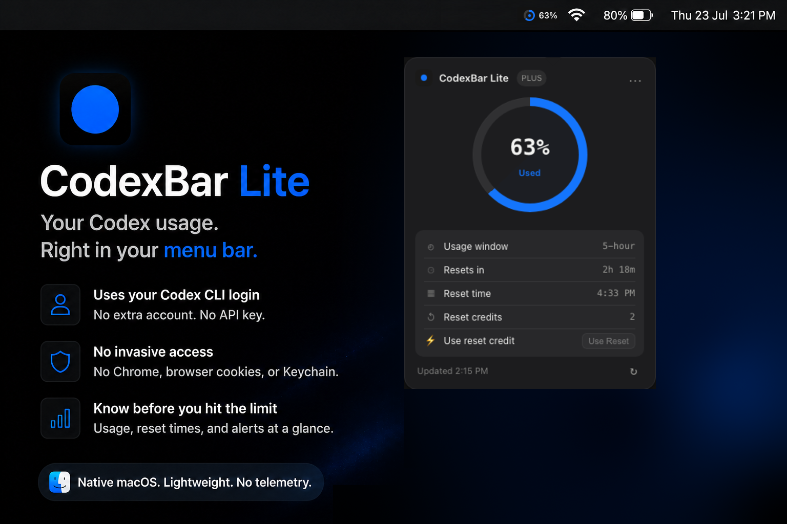
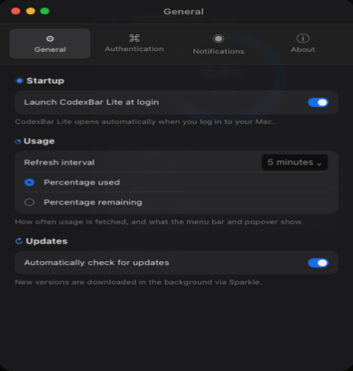

<h1 align="center">CodexBar Lite</h1>

<p align="center">
  <strong>Native AI coding quota tracker for your macOS menu bar.</strong><br>
  Codex, Claude Code, OpenCode Go, GitHub Copilot, and Gemini Antigravity.<br>
  HTTP-only usage collection. No browser cookies, telemetry, or third-party backend.<br>
  <a href="https://getcodexbar.xyz"><strong>getcodexbar.xyz</strong></a>
</p>

> CodexBar Lite is an independent community project and is not affiliated with OpenAI.

> **Unreleased development build.** Multi-provider support and the redesigned popover described here are source changes, not part of the linked v0.2.5 download. The landing page and older screenshots still describe that published Codex-only release.

<p align="center">
  <a href="https://github.com/wei-b0/codexbar-lite/releases/latest">
    
  </a>
</p>

<p align="center">
  
  
  
  
</p>

<p align="center">
  <a href="https://www.producthunt.com/products/codexbar-lite/launches/codexbar-lite?embed=true&amp;utm_source=badge-featured&amp;utm_medium=badge&amp;utm_campaign=badge-codexbar-lite" target="_blank" rel="noopener noreferrer"></a>
</p>

<p align="center">
  
</p>

## Why CodexBar Lite?

CodexBar Lite exists because checking AI coding quotas should not require a dashboard, browser cookies, or unrelated system permissions.

It reuses provider credentials already on your Mac, lets you add OpenCode Go and GitHub tokens securely, and queries provider HTTP APIs directly.

## Features

- Native macOS menu bar app
- Individual progress bars and reset times for every enabled provider
- Compact summaries show the most-constrained window. Expand a provider to see all its windows; Antigravity accounts are grouped together.
- OpenAI Codex, Claude Code, OpenCode Go, GitHub Copilot, and Gemini Antigravity
- Notifications at 80%, 90%, exhaustion, and quota reset
- Percentage used or percentage remaining - your choice
- Automatic refresh with cached usage when offline
- Each provider updates as its request finishes. Refresh respects per-provider retry delays, including server rate limits.
- Launch at login and over-the-air updates with Sparkle
- Per-provider enable and disable controls

No dashboards, browser extensions, graphs, themes, or CodexBar account. The menu bar is still the entire job.

## Security model

Usage trackers often ask you to hand over access to sensitive parts of your Mac just to display a number.

> **CodexBar Lite does not access browser profiles or cookies, invoke provider CLIs for usage, request Accessibility, Screen Recording, or Full Disk Access, or send credentials through a third-party backend.**

CodexBar Lite:

- Reads provider OAuth credentials from their existing local files or Keychain entries
- Stores manually configured OpenCode Go and GitHub tokens in the macOS Keychain
- Makes usage requests directly to OpenAI, Anthropic, OpenCode, GitHub, and Google
- Stores local preferences, credential caches and timestamped quota readings

It does not:

- Access browser cookies or Chrome profiles
- Upload credentials to any third-party server
- Scrape provider dashboards
- Invoke `codex`, `claude`, `opencode`, `gh`, or Antigravity to collect usage
- Run telemetry or analytics

Credentials are sent only to the provider that issued them. GitHub and OpenCode Go tokens entered in Settings are stored in the macOS Keychain.

## How it works

Open the app and enable the providers you use in **Settings → Integrations**. Codex can launch `codex login`; Claude and Antigravity reuse existing OAuth sign-ins; OpenCode Go and GitHub tokens can be entered directly.

Depending on enabled providers, CodexBar Lite can read:

```text
~/.codex/auth.json
~/.local/share/opencode/auth.json
~/.local/share/opencode/antigravity-accounts.json
```

Claude Code and Antigravity credentials may also come from their existing macOS Keychain entries.

### Provider access

| Provider | Usage source | Authentication |
| --- | --- | --- |
| Codex | `chatgpt.com/backend-api/wham/usage`, with the legacy Codex endpoint as a 404 fallback | Existing Codex OAuth session |
| Claude Code | `api.anthropic.com/api/oauth/usage` | Existing Claude Code or OpenCode OAuth session |
| OpenCode Go | `opencode.ai/zen/go/v1/usage` | OpenCode credentials or a key entered in Settings |
| GitHub Copilot | `api.github.com/copilot_internal/user` | Token entered in Settings |
| Antigravity | Google Code Assist `loadCodeAssist`, quota summary, or model quotas | Existing Antigravity Keychain or OpenCode plugin credentials |

Some endpoints are unofficial and can change. GitHub's internal quota endpoint does **not** accept every personal access token. A saved token is marked verified only after a successful quota response. An authorization failure is displayed, never replaced with an estimated percentage. Claude polling is read-only and does not submit model inference requests.

Antigravity contains no embedded Google OAuth client secrets. A still-valid access token from the existing login can be used directly. Refresh-only credentials or expired access tokens require a matching `ANTIGRAVITY_OAUTH_CLIENT_ID` / `ANTIGRAVITY_OAUTH_CLIENT_SECRET` pair in the app process environment, or the corresponding `GEMINI_OAUTH_CLIENT_ID` / `GEMINI_OAUTH_CLIENT_SECRET` pair. Finder-launched apps do not inherit a terminal's environment; launch from the configured environment when using this path. Never commit these values. Without them, refresh reports a setup error instead of silently substituting credentials.

Refreshing is limited to once per minute per provider, or once per five minutes for Claude. Failed requests back off up to 30 minutes; a longer server `Retry-After` is respected. The global refresh interval still determines when eligible providers are polled. Display preference changes and opening the popover do not trigger HTTP requests.

Quota snapshots store a separate success timestamp per integration in `~/Library/Application Support/CodexBarLite/quotas-v2.json`. Cached data is identified as saved or stale. The old `usage.json` and first-pass `integrations.json` caches are not migrated. Clearing a configured token disables that provider and drops its cached readings. Codex OAuth refresh preserves unknown auth-file fields; refreshed Claude credentials are cached separately in Keychain and tied to the source sign-in.

## Requirements

- macOS 13 Ventura or newer
- Apple Silicon Mac (arm64)
- At least one supported provider account

## Install

1. [Download the latest release](https://github.com/wei-b0/codexbar-lite/releases/download/v0.2.5/CodexBarLite-0.2.5-arm64.dmg).
2. Open the downloaded `.dmg`.
3. Drag CodexBar Lite into `/Applications`.
4. Open it.

Future versions install through **CodexBar Lite → Check for Updates…**.

## Settings

- Refresh every 1, 5, 15, or 30 minutes
- Launch at Login
- Percentage used or remaining
- Automatic update checks
- Notification controls
- Provider toggles
- Secure OpenCode Go and GitHub token fields

<p align="center">
  
</p>

## Build from source

Requires Swift 5.10 or newer and Apple Command Line Tools.

```bash
swift build -Xswiftc -warnings-as-errors
BUILD_ONLY=1 ./scripts/install.sh
```

This builds `dist/CodexBarLite.app` without replacing the installed app. Running `./scripts/install.sh` without `BUILD_ONLY=1` replaces `/Applications/CodexBarLite.app` and launches it.

Run the offline regression checks and native UI snapshots:

```bash
bash scripts/check.sh
```

The checks compile the actual app sources with `swiftc`, so they run with Command Line Tools alone. They do not require XCTest, access provider credentials, send live requests, or modify your app preferences. They cover parsers, auth-file preservation, refresh cancellation/backoff, cached timestamps, view reuse, expansion, scrolling, and light/dark/error/empty states. The printed timings measure the fixture UI, not live provider latency.

Create a signed Sparkle release:

```bash
./scripts/release.sh <version> <build-number>
```

## Uninstall

Quit CodexBar Lite and move it from `/Applications` to Trash.

Optional local-data cleanup:

```bash
rm -rf ~/Library/Application\ Support/CodexBarLite
defaults delete dev.vaibhav.codexbar
```

## Independent by design

CodexBar Lite is an independent utility and is not affiliated with, endorsed by, or sponsored by OpenAI.
